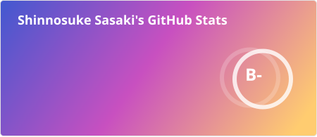
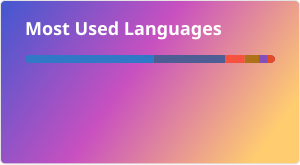

<h1>Hi, I'm Fybrid! 👋</h2>

<h2>👨‍💻 &nbsp;About Me</h2>

- 🇯🇵 I’m a Japanese programmer learning software development.

- 🎓 I graduated from an IT college this March.

- 💻 This April, I started working as a software engineer in Tokyo.

<!-- TODO: Update-->
<!-- ## 🌱 Currently Exploring -->

<!-- TODO: Update-->
<!-- ## 🏆 Achievements -->

<h2>📚 &nbsp;Languages</h2>

<h3>⭐️ &nbsp;Favorites<h3>

<h3>✍🏻 &nbsp;Have Used or Learned<h3>

<h2>🛠️ &nbsp;Tools</h2>

<h2>🔗 &nbsp;Links</h2>

<h3>✨ &nbsp;My Latest Articles<h3>

- [GitHub Profileをかっこよくしたい！](https://zenn.dev/fybrid/articles/8de77ef352ae3d)(JP)

<h3>🌐 &nbsp;Profiles<h3>

- [Zenn](https://zenn.dev/fybrid)

<h2>⚡ &nbsp;GitHub Stats</h2>

